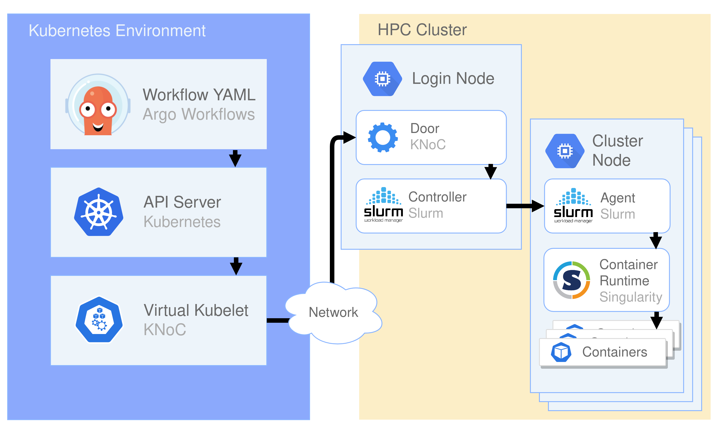

# KNoC - A Kubernetes Node to manage container lifecycle on HPC clusters

KNoC is a [Virtual Kubelet](https://github.com/virtual-kubelet/virtual-kubelet) Provider implementation that manages real pods and containers in a remote container runtime by supporting the lifecycle management of pods, containers and other resources in the context of Kubernetes.

[Virtual Kubelet](https://github.com/virtual-kubelet/virtual-kubelet) is an open source [Kubernetes](https://kubernetes.io/) kubelet implementation that masquerades as a kubelet for the purposes of connecting Kubernetes to other APIs.

Remote environments include [Singularity](https://sylabs.io/singularity/) container runtime utilizing [Slurm's](https://slurm.schedmd.com/) resource management and job scheduling

## Features
- Create, delete and update pods
- Container logs and exec
- Get pod, pods and pod status
- Support for EmptyDirs, Secrets and ConfigMaps



## Installation
- First, install [skaffold from here](https://skaffold.dev/docs/install/)
- Then install go dependencies for KNoC and build:
```bash
go get github.com/sfreiberg/simplessh
go get golang.org/x/crypto/ssh/terminal@v0.0.0-20201221181555-eec23a3978ad
#builds the KNoC("virtual-kubelet") binary
make build
```

- Optionally, make a container:
```bash
make container
```

- Prepare the secret needed for the communication with the remote system:
```bash
# generate a secret with ssh keys and remote-user
kubectl create secret generic remote-secret \
    --from-file=ssh-privatekey=$HOME/.ssh/id_rsa \
    --from-file=ssh-publickey=$HOME/.ssh/id_rsa.pub \
    --from-literal=remote_user="<USER>" \
    --from-literal=host="<HOST>" \
    --from-literal=port="<PORT>"
```


## Running
```bash
#Builds a container for the knoc-vkubelet and deploys it on your k8s
#using the existing k8s context and config
#(skaffold: by default in dev mode)
make skaffold
```

## Setup in minikube
```bash
minikube start --kubernetes-version=v1.19.13 --apiserver-ips=<host-ip>
# then copy your local certificates and configs from ~/.minikube to your "knoc-targetted" system

# --apiserver-ips flag is used so that minikube apiserver can be accesed outside the local network it resides.
```

After setting up argo you can run a sample workflow located in examples/
